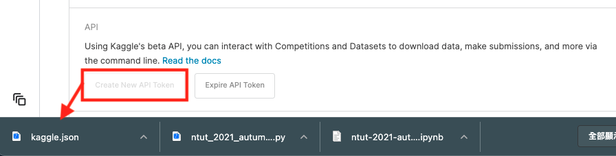
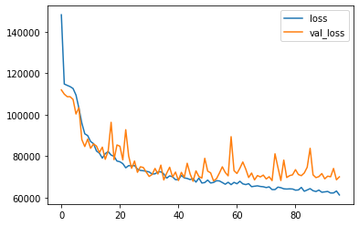

# Machine Learning@NTUT-2021-Autumn-Regression

此專案為北科大機器學習的作業: 房價預測 [kaggle 比賽連結](https://www.kaggle.com/c/machine-learningntut-2021-autumn-regression)

# 環境設定

## Docker

為了建立獨立的開發環境，本專案需安裝 docker

## kaggle API key

本次作業的 dataset 須透過 kaggle 套件下載，需登入 kaggle 設定頁面下載自己的 API key 檔案，並將下載的`kaggle.json`複製至本專案根目錄


## Build Docker Image

透過以下指令建立 Docker image

```shell
$ bash build.sh
```

會執行以下流程:

- 使用 python 官方的 Docker Image 作為訓練環境 ([Python Official Image](https://hub.docker.com/_/python))
- 下載並安裝 python 相關套件
- 匯入 kaggle API key 以下載 dataset 並解壓縮

## 訓練模型

透過以下指令訓練模型

```shell
$ bash train.sh
```

會執行以下流程:

- 基於剛剛建立的 Docker Image 執行 Docker Container
- 將專案根目錄掛載至 Docker Container 的路徑`/usr/src/app`
- 在 Docker Container 中執行 `train.py`

## 預測結果

透過以下指令訓練模型

```shell
$ bash test.sh
```

會執行以下流程:

- 基於剛剛建立的 Docker Image 執行 Docker Container
- 將專案根目錄掛載至 Docker Container 的路徑`/usr/src/app`
- 在 Docker Container 中執行 `test.py`

# 資料分析

分析每一欄位與`price`相關性

```python
df.corr().sort_values(by=['price'])['price']
```

```
zipcode         -0.051056
sale_month      -0.023457
id              -0.016893
sale_day        -0.011428
sale_yr          0.008044
long             0.021472
condition        0.033654
yr_built         0.059349
sqft_lot15       0.079869
sqft_lot         0.101017
yr_renovated     0.126295
floors           0.236195
waterfront       0.270146
bedrooms         0.301306
lat              0.309061
sqft_basement    0.326485
view             0.401936
bathrooms        0.521275
sqft_living15    0.586500
sqft_above       0.602456
grade            0.671454
sqft_living      0.699196
price            1.000000
```

將相關性低的欄位移除

```python
drop_cols = ['id', 'sale_month', 'sale_day', 'zipcode', 'condition', 'yr_renovated']
```

# 資料預處理

避免 dataset 分割的 train, valid 資料不均勻，訓練時會將兩組資料混合處理

```python
merge_df = train_df.append(valid_df, ignore_index=True)
```

## 移除不合理的資料

1. `bedroom`過多的資料

```python
merge_df = merge_df[merge_df['bedrooms'] < 30]
```

2. `bathrooms`與`bedrooms`為 0 的資料

```python
merge_df = merge_df[merge_df['bathrooms'] != 0]
merge_df = merge_df[merge_df['bedrooms'] != 0]
```

## `yr_built`, `yr_renovated`欄位的合併

`yr_built`, `yr_renovated` 分別代表 `建造時間` 與 `翻修時間`，處理策略為：將有翻修過的資料取出，並將該筆資料的建立年份改為翻修年份(test data 也要做相同的處理)。

```python
merge_df.loc[merge_df['yr_renovated'] != 0, 'yr_built'] = merge_df['yr_renovated']
test_df.loc[test_df['yr_renovated'] != 0, 'yr_built'] = test_df['yr_renovated']
```

## 分割 train, valid 資料

`random_state`: 每次亂數分割都是相同的資料，確保可重現相同的測試資料

## 資料正規劃

```python
mean = x_train.mean()
std = x_train.std()
x_train = (x_train-mean) / std
x_valid = (x_valid-mean) / std
x_test = (x_test-mean) / std
```

```python
from sklearn.model_selection import train_test_split
train, valid = train_test_split(merge_df, test_size=0.2, random_state=103)
```

# 建立訓練模型

## model

```python
model.summary()
```

```
_________________________________________________________________
Layer (type)                 Output Shape              Param #
=================================================================
dense (Dense)                (None, 64)                1088
_________________________________________________________________
dense_1 (Dense)              (None, 64)                4160
_________________________________________________________________
dense_2 (Dense)              (None, 64)                4160
_________________________________________________________________
dense_3 (Dense)              (None, 64)                4160
_________________________________________________________________
dense_4 (Dense)              (None, 32)                2080
_________________________________________________________________
dense_5 (Dense)              (None, 32)                1056
_________________________________________________________________
dense_6 (Dense)              (None, 1)                 33
=================================================================
Total params: 16,737
Trainable params: 16,737
Non-trainable params: 0
_________________________________________________________________
```

## 設定 callback

1. Early Stop: 當`val_loss`沒有進步(數值下降)超過 50 epochs，就自動停止訓練
2. Check Point: 每一 epoch 紀錄`val_loss`數值，當`val_loss`超過最佳紀錄時，儲存權重資料至 `model.h5`

```python
es = callbacks.EarlyStopping(patience=50, monitor='val_loss', mode='auto')
check_point = callbacks.ModelCheckpoint(
    'model.h5',
    monitor='val_loss',
    verbose=3,
    save_best_only=True,
    save_weight_only=True,
    mode='auto',
    period=1
)
my_callbacks = [es, check_point]
```

## 訓練結果



# 預測結果

本次作業繳交成績

